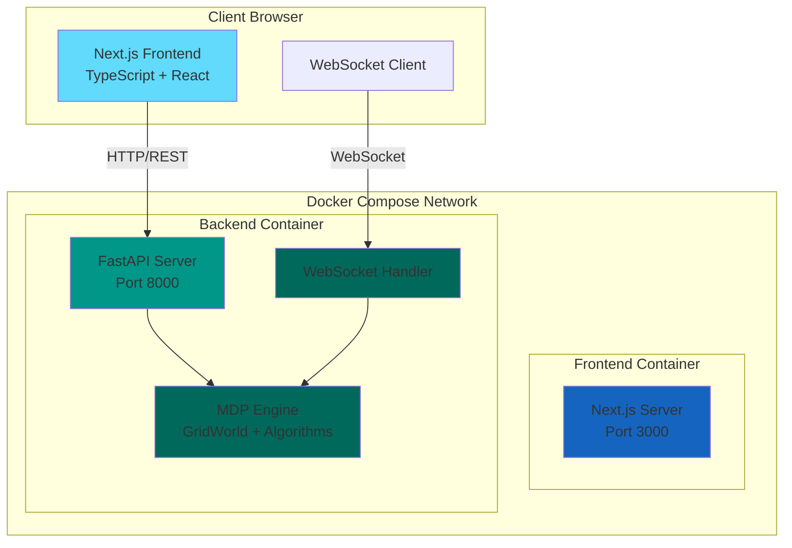
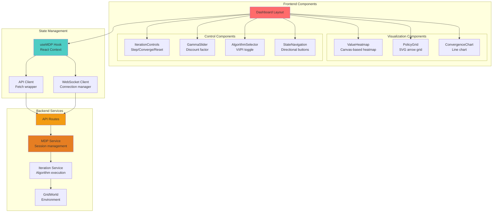
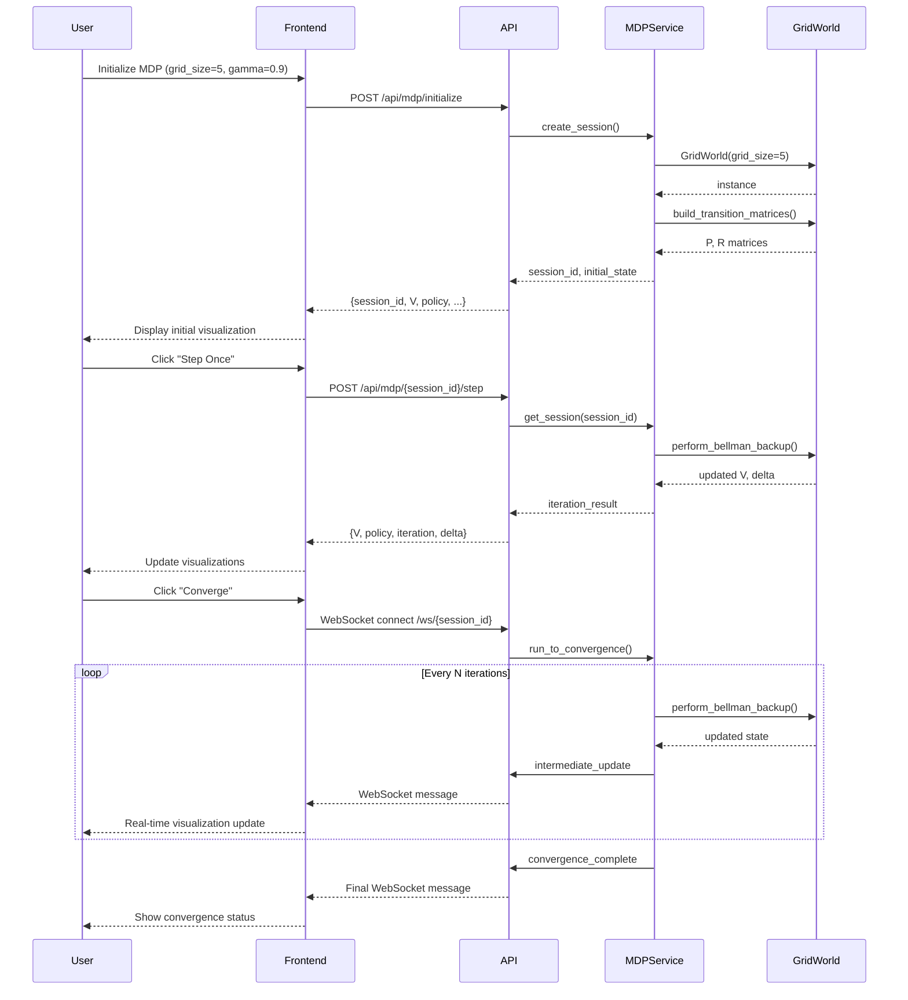

# Architecture Documentation

## System Overview

The MDP Visualizer is a full-stack web application designed to provide interactive visualization and exploration of Markov Decision Process algorithms. The system follows a modern microservices architecture with a clear separation between frontend presentation, backend business logic, and the core MDP computation engine.

---

## High-Level Architecture

### Architecture Layers

1. **Presentation Layer** (Frontend)
   - Next.js 14+ with App Router
   - React 18+ for UI components
   - TypeScript for type safety
   - Tailwind CSS for styling
   - Real-time visualization with Canvas/SVG and Recharts

2. **API Layer** (Backend)
   - FastAPI for REST endpoints
   - WebSocket support for real-time updates
   - Pydantic for data validation
   - Session management for concurrent users

3. **Business Logic Layer** (Services)
   - MDP service for session orchestration
   - Iteration service for algorithm execution
   - State management and caching

4. **Core Layer** (MDP Engine)
   - GridWorld environment implementation
   - Value Iteration algorithm
   - Policy Iteration algorithm
   - Matrix operations with NumPy

---

## Component Architecture

---

## Data Flow Architecture

---

## See Also

- [API Documentation](./API.md) - Complete REST and WebSocket API reference
- [Development Guide](./DEVELOPMENT.md) - Setup and development workflow
- [Deployment Guide](./DEPLOYMENT.md) - Production deployment instructions 