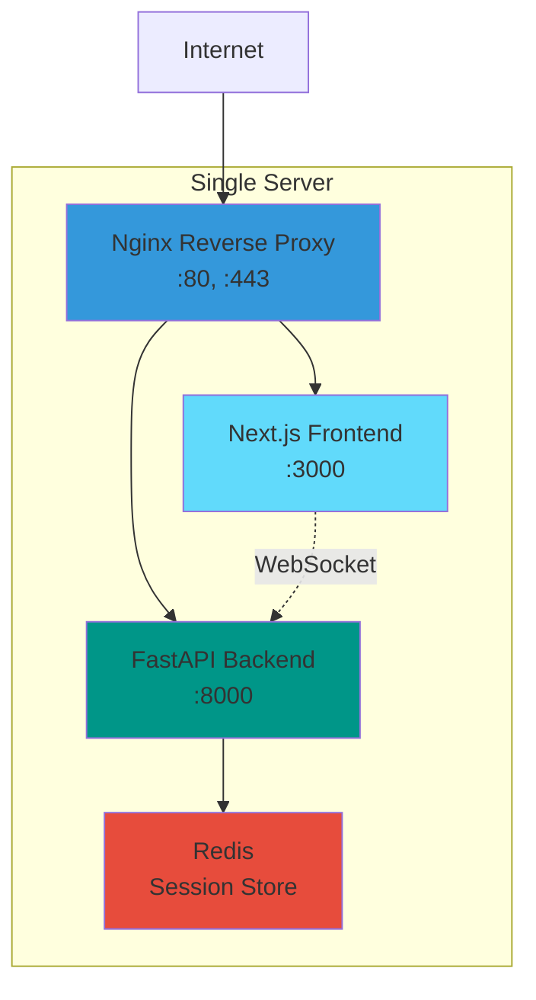
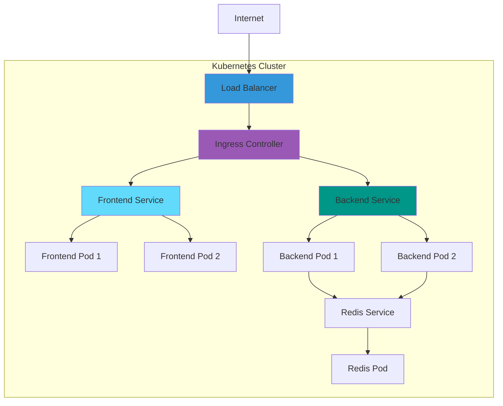

# Deployment Guide

Complete guide for deploying the MDP Visualizer to production environments.

---

## Table of Contents

- [Overview](#overview)
- [Prerequisites](#prerequisites)
- [Deployment Options](#deployment-options)
- [Docker Compose Deployment](#docker-compose-deployment)
- [Kubernetes Deployment](#kubernetes-deployment)
- [Cloud Platform Deployments](#cloud-platform-deployments)
  - [AWS](#aws-deployment)
  - [Google Cloud](#google-cloud-deployment)
  - [Azure](#azure-deployment)
  - [DigitalOcean](#digitalocean-deployment)
- [Environment Configuration](#environment-configuration)
- [Security Hardening](#security-hardening)
- [Monitoring & Logging](#monitoring--logging)
- [Backup & Recovery](#backup--recovery)
- [Scaling](#scaling)
- [CI/CD Pipeline](#cicd-pipeline)
- [Troubleshooting](#troubleshooting)

---

## Overview

The MDP Visualizer can be deployed as:
1. **Single-Server Docker Compose** - Simple, suitable for MVP/small scale
2. **Kubernetes Cluster** - Scalable, production-grade
3. **Serverless** - Cost-effective for variable traffic

This guide focuses on production-ready deployments with proper security, monitoring, and scaling capabilities.

---

## Prerequisites

### Required Tools

- Docker 24.0+
- Docker Compose 2.20+ (for Docker deployment)
- kubectl (for Kubernetes deployment)
- Cloud CLI tools (AWS CLI, gcloud, az)
- Git

### Domain & SSL

- Registered domain name
- SSL certificate (Let's Encrypt recommended)

### Resource Requirements

**Minimum (Single Server)**:
- 2 CPU cores
- 4GB RAM
- 20GB SSD storage
- 100Mbps network

**Recommended (Production)**:
- 4+ CPU cores
- 8GB+ RAM
- 50GB SSD storage
- 1Gbps network

---

## Deployment Options

### Comparison Matrix

| Feature | Docker Compose | Kubernetes | Serverless |
|---------|---------------|------------|------------|
| Complexity | Low | High | Medium |
| Scalability | Manual | Automatic | Automatic |
| Cost | Fixed | Variable | Usage-based |
| Maintenance | Low | High | Low |
| Best For | MVP, Small | Production | Variable load |

---

## Docker Compose Deployment

### Production Architecture



### Step-by-Step Deployment

#### 1. Server Setup

```bash
# Update system
sudo apt update && sudo apt upgrade -y

# Install Docker
curl -fsSL https://get.docker.com -o get-docker.sh
sudo sh get-docker.sh
sudo usermod -aG docker $USER

# Install Docker Compose
sudo apt install docker-compose-plugin -y

# Verify installation
docker --version
docker compose version
```

#### 2. Clone Repository

```bash
# Create app directory
sudo mkdir -p /opt/mdp-visualizer
sudo chown $USER:$USER /opt/mdp-visualizer
cd /opt/mdp-visualizer

# Clone code
git clone https://github.com/yourusername/markov-decision-processes.git .
```

#### 3. Configure Environment

Create production environment files:

**`.env`** (root):
```env
# Environment
ENVIRONMENT=production
NODE_ENV=production

# Domain
DOMAIN=yourdomain.com

# Backend
BACKEND_PORT=8000
LOG_LEVEL=info
SESSION_TIMEOUT_MINUTES=30
MAX_GRID_SIZE=20

# Frontend
FRONTEND_PORT=3000
NEXT_PUBLIC_API_URL=https://yourdomain.com/api
NEXT_PUBLIC_WS_URL=wss://yourdomain.com/ws

# Redis
REDIS_HOST=redis
REDIS_PORT=6379
REDIS_PASSWORD=your-secure-password-here

# Security
SECRET_KEY=your-secret-key-here-minimum-32-characters
CORS_ORIGINS=https://yourdomain.com

# SSL
SSL_CERTIFICATE_PATH=/etc/letsencrypt/live/yourdomain.com/fullchain.pem
SSL_CERTIFICATE_KEY_PATH=/etc/letsencrypt/live/yourdomain.com/privkey.pem
```

#### 4. Setup SSL Certificate

```bash
# Install Certbot
sudo apt install certbot -y

# Obtain certificate
sudo certbot certonly --standalone \
  -d yourdomain.com \
  -d www.yourdomain.com \
  --email your@email.com \
  --agree-tos \
  --non-interactive

# Setup auto-renewal
echo "0 0,12 * * * root certbot renew --quiet" | sudo tee -a /etc/crontab > /dev/null
```

#### 5. Create Production Docker Compose

**`docker-compose.prod.yml`**:
```yaml
version: '3.9'

services:
  nginx:
    image: nginx:alpine
    container_name: mdp-nginx
    ports:
      - "80:80"
      - "443:443"
    volumes:
      - ./nginx/nginx.conf:/etc/nginx/nginx.conf:ro
      - ./nginx/ssl:/etc/nginx/ssl:ro
      - /etc/letsencrypt:/etc/letsencrypt:ro
    depends_on:
      - frontend
      - backend
    networks:
      - mdp-network
    restart: unless-stopped

  backend:
    build:
      context: ./backend
      dockerfile: Dockerfile
      target: production
    container_name: mdp-backend
    expose:
      - "8000"
    environment:
      - ENVIRONMENT=production
      - LOG_LEVEL=info
      - REDIS_HOST=redis
      - REDIS_PORT=6379
      - REDIS_PASSWORD=${REDIS_PASSWORD}
      - SECRET_KEY=${SECRET_KEY}
      - CORS_ORIGINS=${CORS_ORIGINS}
    depends_on:
      - redis
    networks:
      - mdp-network
    restart: unless-stopped
    healthcheck:
      test: ["CMD", "curl", "-f", "http://localhost:8000/health"]
      interval: 30s
      timeout: 10s
      retries: 3
      start_period: 40s

  frontend:
    build:
      context: ./frontend
      dockerfile: Dockerfile
      target: production
      args:
        - NEXT_PUBLIC_API_URL=${NEXT_PUBLIC_API_URL}
        - NEXT_PUBLIC_WS_URL=${NEXT_PUBLIC_WS_URL}
    container_name: mdp-frontend
    expose:
      - "3000"
    environment:
      - NODE_ENV=production
    networks:
      - mdp-network
    restart: unless-stopped
    healthcheck:
      test: ["CMD", "curl", "-f", "http://localhost:3000"]
      interval: 30s
      timeout: 10s
      retries: 3
      start_period: 40s

  redis:
    image: redis:7-alpine
    container_name: mdp-redis
    command: redis-server --requirepass ${REDIS_PASSWORD}
    volumes:
      - redis-data:/data
    networks:
      - mdp-network
    restart: unless-stopped
    healthcheck:
      test: ["CMD", "redis-cli", "ping"]
      interval: 10s
      timeout: 3s
      retries: 3

volumes:
  redis-data:
    driver: local

networks:
  mdp-network:
    driver: bridge
```

#### 6. Nginx Configuration

**`nginx/nginx.conf`**:
```nginx
events {
    worker_connections 1024;
}

http {
    upstream backend {
        server backend:8000;
    }

    upstream frontend {
        server frontend:3000;
    }

    # Rate limiting
    limit_req_zone $binary_remote_addr zone=api_limit:10m rate=10r/s;
    limit_req_zone $binary_remote_addr zone=ws_limit:10m rate=5r/s;

    # Redirect HTTP to HTTPS
    server {
        listen 80;
        server_name yourdomain.com www.yourdomain.com;
        return 301 https://$server_name$request_uri;
    }

    # HTTPS Server
    server {
        listen 443 ssl http2;
        server_name yourdomain.com www.yourdomain.com;

        # SSL Configuration
        ssl_certificate /etc/letsencrypt/live/yourdomain.com/fullchain.pem;
        ssl_certificate_key /etc/letsencrypt/live/yourdomain.com/privkey.pem;
        ssl_protocols TLSv1.2 TLSv1.3;
        ssl_ciphers HIGH:!aNULL:!MD5;
        ssl_prefer_server_ciphers on;

        # Security Headers
        add_header Strict-Transport-Security "max-age=31536000; includeSubDomains" always;
        add_header X-Frame-Options "SAMEORIGIN" always;
        add_header X-Content-Type-Options "nosniff" always;
        add_header X-XSS-Protection "1; mode=block" always;

        # API Proxy
        location /api/ {
            limit_req zone=api_limit burst=20;
            proxy_pass http://backend/api/;
            proxy_set_header Host $host;
            proxy_set_header X-Real-IP $remote_addr;
            proxy_set_header X-Forwarded-For $proxy_add_x_forwarded_for;
            proxy_set_header X-Forwarded-Proto $scheme;
        }

        # WebSocket Proxy
        location /ws/ {
            limit_req zone=ws_limit burst=10;
            proxy_pass http://backend/ws/;
            proxy_http_version 1.1;
            proxy_set_header Upgrade $http_upgrade;
            proxy_set_header Connection "upgrade";
            proxy_set_header Host $host;
            proxy_set_header X-Real-IP $remote_addr;
            proxy_read_timeout 86400;
        }

        # Frontend
        location / {
            proxy_pass http://frontend;
            proxy_set_header Host $host;
            proxy_set_header X-Real-IP $remote_addr;
            proxy_set_header X-Forwarded-For $proxy_add_x_forwarded_for;
            proxy_set_header X-Forwarded-Proto $scheme;
        }

        # Static assets caching
        location /_next/static {
            proxy_pass http://frontend;
            proxy_cache_valid 200 60m;
            add_header Cache-Control "public, immutable";
        }
    }
}
```

#### 7. Deploy Application

```bash
# Build images
docker compose -f docker-compose.prod.yml build

# Start services
docker compose -f docker-compose.prod.yml up -d

# Check status
docker compose -f docker-compose.prod.yml ps

# View logs
docker compose -f docker-compose.prod.yml logs -f
```

#### 8. Verify Deployment

```bash
# Check health endpoints
curl https://yourdomain.com/api/health

# Test WebSocket (using wscat)
npm install -g wscat
wscat -c wss://yourdomain.com/ws/test-session-id

# Monitor logs
docker compose -f docker-compose.prod.yml logs -f backend
```

---

## Kubernetes Deployment

### Cluster Architecture



### Kubernetes Manifests

#### Namespace

**`k8s/namespace.yaml`**:
```yaml
apiVersion: v1
kind: Namespace
metadata:
  name: mdp-visualizer
```

#### ConfigMap

**`k8s/configmap.yaml`**:
```yaml
apiVersion: v1
kind: ConfigMap
metadata:
  name: mdp-config
  namespace: mdp-visualizer
data:
  ENVIRONMENT: "production"
  LOG_LEVEL: "info"
  REDIS_HOST: "redis-service"
  REDIS_PORT: "6379"
  SESSION_TIMEOUT_MINUTES: "30"
  MAX_GRID_SIZE: "20"
```

#### Secrets

```bash
# Create secrets
kubectl create secret generic mdp-secrets \
  --from-literal=redis-password='your-secure-password' \
  --from-literal=secret-key='your-secret-key' \
  --namespace=mdp-visualizer
```

#### Backend Deployment

**`k8s/backend-deployment.yaml`**:
```yaml
apiVersion: apps/v1
kind: Deployment
metadata:
  name: backend
  namespace: mdp-visualizer
spec:
  replicas: 3
  selector:
    matchLabels:
      app: backend
  template:
    metadata:
      labels:
        app: backend
    spec:
      containers:
      - name: backend
        image: your-registry/mdp-backend:latest
        ports:
        - containerPort: 8000
        envFrom:
        - configMapRef:
            name: mdp-config
        env:
        - name: REDIS_PASSWORD
          valueFrom:
            secretKeyRef:
              name: mdp-secrets
              key: redis-password
        - name: SECRET_KEY
          valueFrom:
            secretKeyRef:
              name: mdp-secrets
              key: secret-key
        resources:
          requests:
            memory: "512Mi"
            cpu: "500m"
          limits:
            memory: "1Gi"
            cpu: "1000m"
        livenessProbe:
          httpGet:
            path: /health
            port: 8000
          initialDelaySeconds: 30
          periodSeconds: 10
        readinessProbe:
          httpGet:
            path: /health
            port: 8000
          initialDelaySeconds: 5
          periodSeconds: 5
```

#### Frontend Deployment

**`k8s/frontend-deployment.yaml`**:
```yaml
apiVersion: apps/v1
kind: Deployment
metadata:
  name: frontend
  namespace: mdp-visualizer
spec:
  replicas: 2
  selector:
    matchLabels:
      app: frontend
  template:
    metadata:
      labels:
        app: frontend
    spec:
      containers:
      - name: frontend
        image: your-registry/mdp-frontend:latest
        ports:
        - containerPort: 3000
        env:
        - name: NODE_ENV
          value: "production"
        - name: NEXT_PUBLIC_API_URL
          value: "https://yourdomain.com/api"
        resources:
          requests:
            memory: "256Mi"
            cpu: "250m"
          limits:
            memory: "512Mi"
            cpu: "500m"
```

#### Services

**`k8s/services.yaml`**:
```yaml
apiVersion: v1
kind: Service
metadata:
  name: backend-service
  namespace: mdp-visualizer
spec:
  selector:
    app: backend
  ports:
  - protocol: TCP
    port: 8000
    targetPort: 8000
  type: ClusterIP
---
apiVersion: v1
kind: Service
metadata:
  name: frontend-service
  namespace: mdp-visualizer
spec:
  selector:
    app: frontend
  ports:
  - protocol: TCP
    port: 3000
    targetPort: 3000
  type: ClusterIP
---
apiVersion: v1
kind: Service
metadata:
  name: redis-service
  namespace: mdp-visualizer
spec:
  selector:
    app: redis
  ports:
  - protocol: TCP
    port: 6379
    targetPort: 6379
  type: ClusterIP
```

#### Ingress

**`k8s/ingress.yaml`**:
```yaml
apiVersion: networking.k8s.io/v1
kind: Ingress
metadata:
  name: mdp-ingress
  namespace: mdp-visualizer
  annotations:
    cert-manager.io/cluster-issuer: "letsencrypt-prod"
    nginx.ingress.kubernetes.io/rate-limit: "100"
spec:
  ingressClassName: nginx
  tls:
  - hosts:
    - yourdomain.com
    secretName: mdp-tls
  rules:
  - host: yourdomain.com
    http:
      paths:
      - path: /api
        pathType: Prefix
        backend:
          service:
            name: backend-service
            port:
              number: 8000
      - path: /ws
        pathType: Prefix
        backend:
          service:
            name: backend-service
            port:
              number: 8000
      - path: /
        pathType: Prefix
        backend:
          service:
            name: frontend-service
            port:
              number: 3000
```

#### Horizontal Pod Autoscaler

**`k8s/hpa.yaml`**:
```yaml
apiVersion: autoscaling/v2
kind: HorizontalPodAutoscaler
metadata:
  name: backend-hpa
  namespace: mdp-visualizer
spec:
  scaleTargetRef:
    apiVersion: apps/v1
    kind: Deployment
    name: backend
  minReplicas: 2
  maxReplicas: 10
  metrics:
  - type: Resource
    resource:
      name: cpu
      target:
        type: Utilization
        averageUtilization: 70
  - type: Resource
    resource:
      name: memory
      target:
        type: Utilization
        averageUtilization: 80
```

### Deploy to Kubernetes

```bash
# Apply all manifests
kubectl apply -f k8s/namespace.yaml
kubectl apply -f k8s/configmap.yaml
kubectl apply -f k8s/secrets.yaml
kubectl apply -f k8s/backend-deployment.yaml
kubectl apply -f k8s/frontend-deployment.yaml
kubectl apply -f k8s/services.yaml
kubectl apply -f k8s/ingress.yaml
kubectl apply -f k8s/hpa.yaml

# Check status
kubectl get pods -n mdp-visualizer
kubectl get services -n mdp-visualizer
kubectl get ingress -n mdp-visualizer

# View logs
kubectl logs -f deployment/backend -n mdp-visualizer
```

---

## Cloud Platform Deployments

### AWS Deployment

#### Using ECS (Elastic Container Service)

1. **Push Images to ECR**:
```bash
# Login to ECR
aws ecr get-login-password --region us-east-1 | \
  docker login --username AWS --password-stdin \
  123456789012.dkr.ecr.us-east-1.amazonaws.com

# Build and push
docker build -t mdp-backend ./backend
docker tag mdp-backend:latest \
  123456789012.dkr.ecr.us-east-1.amazonaws.com/mdp-backend:latest
docker push 123456789012.dkr.ecr.us-east-1.amazonaws.com/mdp-backend:latest
```

2. **Create ECS Task Definition**
3. **Create ECS Service with ALB**
4. **Configure Route53 DNS**

### Google Cloud Deployment

#### Using Cloud Run

```bash
# Build and deploy backend
gcloud builds submit --tag gcr.io/PROJECT_ID/mdp-backend ./backend
gcloud run deploy mdp-backend \
  --image gcr.io/PROJECT_ID/mdp-backend \
  --platform managed \
  --region us-central1 \
  --allow-unauthenticated

# Build and deploy frontend
gcloud builds submit --tag gcr.io/PROJECT_ID/mdp-frontend ./frontend
gcloud run deploy mdp-frontend \
  --image gcr.io/PROJECT_ID/mdp-frontend \
  --platform managed \
  --region us-central1 \
  --allow-unauthenticated
```

### DigitalOcean Deployment

#### Using App Platform

1. Connect GitHub repository
2. Configure build settings
3. Set environment variables
4. Deploy with one click

---

## Security Hardening

### SSL/TLS Configuration

```nginx
# Strong SSL configuration
ssl_protocols TLSv1.2 TLSv1.3;
ssl_ciphers ECDHE-RSA-AES128-GCM-SHA256:ECDHE-RSA-AES256-GCM-SHA384;
ssl_prefer_server_ciphers off;
ssl_session_cache shared:SSL:10m;
ssl_session_timeout 10m;
ssl_stapling on;
ssl_stapling_verify on;
```

### Firewall Rules

```bash
# UFW (Ubuntu)
sudo ufw allow 22/tcp   # SSH
sudo ufw allow 80/tcp   # HTTP
sudo ufw allow 443/tcp  # HTTPS
sudo ufw enable
```

### Docker Security

```dockerfile
# Run as non-root user
RUN addgroup --system --gid 1001 appgroup && \
    adduser --system --uid 1001 --gid 1001 appuser
USER appuser
```

---

## Monitoring & Logging

### Prometheus + Grafana

```yaml
# docker-compose.monitoring.yml
services:
  prometheus:
    image: prom/prometheus:latest
    volumes:
      - ./prometheus.yml:/etc/prometheus/prometheus.yml
      - prometheus-data:/prometheus
    ports:
      - "9090:9090"
  
  grafana:
    image: grafana/grafana:latest
    volumes:
      - grafana-data:/var/lib/grafana
    ports:
      - "3001:3000"
    environment:
      - GF_SECURITY_ADMIN_PASSWORD=admin
```

### Logging with ELK Stack

See dedicated logging documentation.

---

## Backup & Recovery

### Redis Backup

```bash
# Create backup script
cat > backup-redis.sh << 'EOF'
#!/bin/bash
BACKUP_DIR=/backups/redis
mkdir -p $BACKUP_DIR
docker exec mdp-redis redis-cli SAVE
docker cp mdp-redis:/data/dump.rdb \
  $BACKUP_DIR/dump-$(date +%Y%m%d-%H%M%S).rdb
EOF

# Setup cron job
0 2 * * * /opt/mdp-visualizer/backup-redis.sh
```

---

## Scaling

### Horizontal Scaling

```bash
# Docker Compose
docker compose -f docker-compose.prod.yml up -d --scale backend=3

# Kubernetes
kubectl scale deployment backend --replicas=5 -n mdp-visualizer
```

---

## CI/CD Pipeline

### GitHub Actions

**`.github/workflows/deploy.yml`**:
```yaml
name: Deploy to Production

on:
  push:
    branches: [main]

jobs:
  deploy:
    runs-on: ubuntu-latest
    steps:
      - uses: actions/checkout@v3
      
      - name: Build images
        run: |
          docker compose -f docker-compose.prod.yml build
      
      - name: Deploy to server
        uses: appleboy/ssh-action@master
        with:
          host: ${{ secrets.SERVER_HOST }}
          username: ${{ secrets.SERVER_USER }}
          key: ${{ secrets.SSH_PRIVATE_KEY }}
          script: |
            cd /opt/mdp-visualizer
            git pull
            docker compose -f docker-compose.prod.yml up -d
```

---

## Troubleshooting

### Common Issues

1. **502 Bad Gateway**: Check backend is running
2. **Connection Refused**: Verify ports and firewall
3. **SSL Errors**: Check certificate paths
4. **Memory Issues**: Increase container limits

### Useful Commands

```bash
# Docker logs
docker compose logs -f

# Container stats
docker stats

# Network inspection
docker network inspect mdp-network

# Execute command in container
docker exec -it mdp-backend bash
```

---

## Support

For deployment issues:
- Check [ARCHITECTURE.md](./ARCHITECTURE.md)
- See [DEVELOPMENT.md](./DEVELOPMENT.md)
- Create GitHub issue
